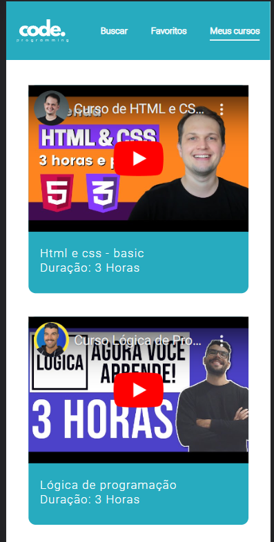

# Prova-Dev-Web

## Descrição do Projeto

Este projeto foi desenvolvido como parte da disciplina de Front-End. Consiste em uma plataforma de cursos onde vídeos do YouTube são incorporados em uma segunda tela. A aplicação é construída utilizando HTML e CSS.

## Telas do Projeto

### Tela 1: Tela de Login:

Esta é a página inicial da plataforma de cursos. Aqui os usuários podem navegar pelos cursos disponíveis e visualizar informações sobre cada um deles.

### Tela 2: Tela Home:

Nesta tela, os vídeos do YouTube são renderizados para que os usuários possam assistir aos cursos selecionados.

## Responsividade

O projeto é completamente responsivo e se adapta a diferentes tamanhos de tela, proporcionando uma experiência de usuário consistente em dispositivos móveis, tablets e desktops.

## Tecnologias Utilizadas

- HTML
- CSS

## Instruções de Execução

1. Clone o repositório para o seu ambiente local.
2. Abra o arquivo `index.html` no seu navegador para acessar a plataforma.

## Licença

Este projeto está sob a Licença MIT - veja o arquivo [LICENSE](LICENSE) para detalhes.
